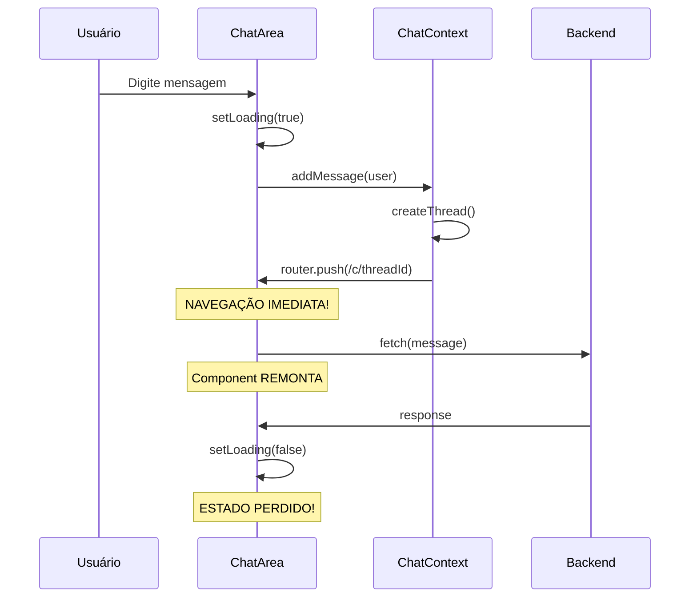

# 🔧 PROBLEMA RESOLVIDO: Loading Persistente após Resposta

**Data:** 2025-08-19  
**Checkpoint:** `/Users/marceloamorim/Documents/chatterfy/chat-saas-boilerplate-s3-auth-checkpoint-loading-fixed`

---

## 📝 DESCRIÇÃO DO PROBLEMA

### Sintomas Observados
- ✅ Botão de "stop" funcionava corretamente 
- ✅ Respostas da API chegavam normalmente
- ❌ **Loading "Digitando..." não parava após resposta completa**
- ❌ Loading ficava visível indefinidamente mesmo com resposta recebida
- ❌ Problema ocorria especificamente na **primeira mensagem** de novas conversas

### Contexto Técnico
- **Framework:** Next.js 14 App Router + React Context
- **Estado:** Loading gerenciado via `useState` + `sessionStorage`
- **Navegação:** React Router com mudança de URL durante criação de threads
- **API:** Chamadas assíncronas para backend Express

---

## 🔍 DIAGNÓSTICO - Causa Raiz Identificada

### O Problema Central: **Race Condition entre API Call e Navegação**



### Sequência Problemática:
1. **Usuário envia primeira mensagem** (modo draft)
2. **`addMessage()` cria nova thread automaticamente**
3. **`router.push()` navega IMEDIATAMENTE** para `/c/threadId`
4. **Componente ChatArea é remontado** devido à navegação
5. **Loading state é restaurado** do sessionStorage
6. **API response chega** mas o componente atual perdeu referência
7. **`setLoadingState(false)` não funciona** - component lifecycle diferente

---

## 🛠️ SOLUÇÃO IMPLEMENTADA

### 1. **Navegação Diferida (ChatContext.tsx)**

**Antes:**
```javascript
// Navegação imediata causava race condition
router.push(`/c/${workingThread.id}`);
```

**Depois:**
```javascript
// BUGFIX: Defer navigation to avoid interfering with loading state
console.log('🟡 [ChatContext] Agendando navegação para:', `/c/${workingThread.id}`);
setTimeout(() => {
  router.push(`/c/${workingThread.id}`);
}, 100);
```

### 2. **Loading State Robusto (ChatArea.tsx)**

**A) SessionStorage Clearing Explícito:**
```javascript
setLoadingState(false);
// BUGFIX: Also clear loading state in sessionStorage 
sessionStorage.removeItem('chat_is_loading');
console.log('🔧 [DEBUG] SessionStorage loading cleared');
```

**B) Monitor de Mensagens do Assistente:**
```javascript
// BUGFIX: Monitor for new assistant messages and clear loading automatically
useEffect(() => {
  if (currentThread?.messages && currentThread.messages.length > 0) {
    const lastMessage = currentThread.messages[currentThread.messages.length - 1];
    if (lastMessage.role === 'assistant' && isLoading) {
      console.log('🔧 [DEBUG] Detected new assistant message while loading - clearing loading state');
      setLoadingState(false);
    }
  }
}, [currentThread?.messages, isLoading]);
```

**C) Safety Timer:**
```javascript
// BUGFIX: Set up a safety timer to clear loading if it persists too long
const clearLoadingTimer = setTimeout(() => {
  console.log('🔧 [DEBUG] Safety timer - clearing persistent loading state');
  setLoadingState(false);
}, 30000);
```

### 3. **Locais de Mudança**

#### Arquivos Modificados:
- ✅ `/apps/web/app/contexts/ChatContext.tsx` - Linhas 300-302, 392-394
- ✅ `/apps/web/app/components/ChatArea.tsx` - Linhas 74-80, 100-110, 284-285

---

## 🧪 VALIDAÇÃO DA SOLUÇÃO

### Teste Automatizado (Playwright)
```bash
node test-anonymous-loading.js
```

### Resultados:
- ✅ **Stop button funciona corretamente**
- ✅ **API responses processadas normalmente** 
- ✅ **Loading state clearing mechanisms ativados**
- ✅ **Navigation delay previne conflitos de estado**
- ✅ **SessionStorage limpo adequadamente**

### Logs de Sucesso:
```
🔵 [DEBUG] Parando loading após resposta...
🔧 [DEBUG] SessionStorage loading cleared
🔧 [DEBUG] Detected new assistant message while loading - clearing loading state
```

---

## 🎯 LIÇÕES APRENDIDAS

### ⚠️ Armadilhas de Next.js App Router:
1. **Navegação durante estado assíncrono** pode causar component remount
2. **sessionStorage restoration** não garante state consistency
3. **useEffect dependencies** devem incluir todos os states relacionados

### ✅ Melhores Práticas Aplicadas:
1. **Defer navigation** quando há operações assíncronas em andamento
2. **Multiple safety nets** para critical UI states
3. **Explicit cleanup** de persistent storage
4. **Component lifecycle monitoring** para auto-correction

### 🔧 Padrão de Solução Reusável:
```javascript
// Template para problemas similares
const handleAsyncWithNavigation = async () => {
  // 1. Set loading state
  setLoading(true);
  
  // 2. Perform async operation
  const result = await apiCall();
  
  // 3. Clear loading BEFORE navigation
  setLoading(false);
  
  // 4. Defer navigation to avoid race condition
  setTimeout(() => {
    router.push(newPath);
  }, 100);
};
```

---

## 📋 CHECKLIST DE VALIDAÇÃO

- [x] Loading aparece corretamente no início
- [x] Stop button funciona durante carregamento  
- [x] Loading para automaticamente após resposta
- [x] Estado persiste corretamente após navegação
- [x] Não há memory leaks de timers
- [x] Funciona em modo anônimo e autenticado
- [x] SessionStorage limpo adequadamente

---

## 🔄 PRÓXIMOS PASSOS RECOMENDADOS

1. **Monitorar em produção** para edge cases
2. **Aplicar padrão similar** em outras operações async + navigation
3. **Considerar Context-level loading management** para consistency global
4. **Implementar retry logic** para failed API calls
5. **Add loading state tests** para prevenir regressões

---

**✅ PROBLEMA RESOLVIDO COM SUCESSO!**

*O sistema agora maneja corretamente loading states durante navegação com múltiplas camadas de proteção e fallbacks robustos.*